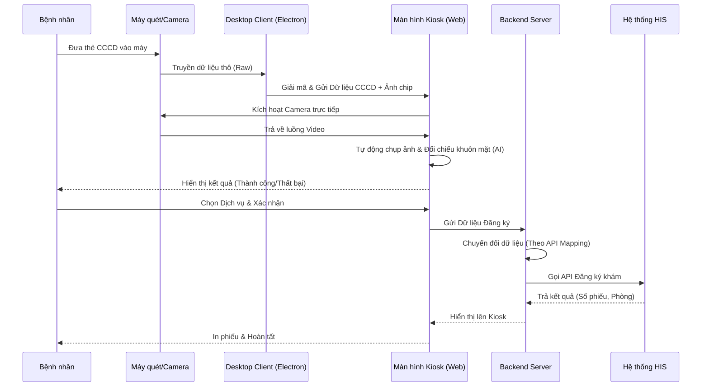

# Quy Trình Hoạt Động Kiosk Tự Đăng Ký Khám (End-to-End)

Tài liệu này mô tả chi tiết toàn bộ vòng đời của một luồng đăng ký khám bệnh tự động, từ lúc bệnh nhân bước vào cho đến khi dữ liệu được đẩy thành công vào hệ thống HIS.

> [!NOTE]
> Hệ thống được thiết kế gồm 3 thành phần chính: **Màn hình Web Kiosk** (giao diện bệnh nhân thao tác), **Desktop Client** (phần mềm chạy ngầm đọc phần cứng), và **Backend Server** (chịu trách nhiệm chuyển đổi và gửi dữ liệu sang HIS).

---

## Sơ đồ Luồng Nghiệp vụ (Workflow)

---

## Diễn giải Chi tiết Từng Bước

### Bước 1: Tiếp nhận và Đọc thẻ (Hardware & Desktop Client)
- Bệnh nhân đến trước máy Kiosk. Màn hình đang ở trạng thái chờ hướng dẫn đút thẻ.
- Bệnh nhân đưa thẻ CCCD gắn chip vào máy quét (Newland/ACR).
- Ứng dụng **Desktop Client** (chạy ngầm trên Kiosk) phát hiện có thẻ. Nó tự động giao tiếp với phần cứng để trích xuất:
  1. Thông tin văn bản (Họ tên, Ngày sinh, Số CCCD, Địa chỉ...).
  2. Ảnh chân dung (được mã hóa dạng Base64) lưu trong chip.
- Desktop Client đóng gói dữ liệu này thành chuẩn JSON và bắn lên **Màn hình Web Kiosk**.

### Bước 2: Xác thực Sinh trắc học (Face Matching trên Web UI)
- Màn hình Web nhận được thông tin CCCD, lập tức bật **Camera Logitech** lên.
- Giao diện yêu cầu bệnh nhân nhìn thẳng vào Camera trong 2 giây.
- Công nghệ AI (`face-api.js`) chạy ngầm trên trình duyệt liên tục quét khuôn mặt từ Camera. Khi lấy được khung hình nét nhất, nó tự động đối chiếu (Match) với bức Ảnh chân dung lấy từ thẻ CCCD.
- **Quy tắc:**
  - Nếu độ khớp > 80%: Cho qua (Pass).
  - Nếu không khớp: Từ chối đăng ký, yêu cầu bệnh nhân đến quầy lễ tân (chống mượn thẻ BHYT người khác).

### Bước 3: Lựa chọn Dịch vụ (Web UI)
- Sau khi xác thực thành công, màn hình hiển thị lời chào (Ví dụ: *"Xin chào Nguyễn Văn A"*).
- Bệnh nhân tiến hành chạm vào màn hình để chọn nhu cầu khám (Ví dụ: Khám BHYT hay Khám Dịch vụ, Chọn khoa Nội hay khoa Ngoại...).
- Bệnh nhân bấm nút **Xác nhận Đăng ký**.

### Bước 4: Chuyển đổi và Gửi dữ liệu (Backend & API Mapping)
- Màn hình Web gói toàn bộ dữ liệu (Thông tin CCCD + Dịch vụ vừa chọn) gửi về **Backend Server**.
- Lúc này, Backend Server sẽ mở cuốn sổ **Cấu hình API HIS** (Chính là thứ mà Admin thiết lập trên trang `/admin/tu-dang-ky/api-mapping`).
- Nó thực hiện thao tác "Chuyển đổi ngôn ngữ":
  - Kiosk gọi là `cccdNumber` ➔ Đổi thành `SoCCCD` (theo HIS).
  - Kiosk gọi là `patientName` ➔ Đổi thành `HoTen` (theo HIS).
- Backend ghép dữ liệu đã đổi tên này vào định dạng JSON và bắn lệnh POST sang Endpoint của phần mềm HIS.

### Bước 5: Nhận kết quả và Hoàn tất
- Phần mềm HIS tiếp nhận dữ liệu giống y hệt như được gửi từ phần mềm Kiosk cũ, xử lý và trả về kết quả (Số phiếu khám, Phòng khám, Tên bác sĩ...).
- Backend nhận kết quả, truyền ngược lại lên Màn hình Web Kiosk.
- Kiosk hiển thị lời cảm ơn, ra lệnh cho máy in nhiệt in ra tờ phiếu nhỏ. Bệnh nhân cầm phiếu và đi đến phòng khám. Quá trình kết thúc (Màn hình reset lại trạng thái chờ).
